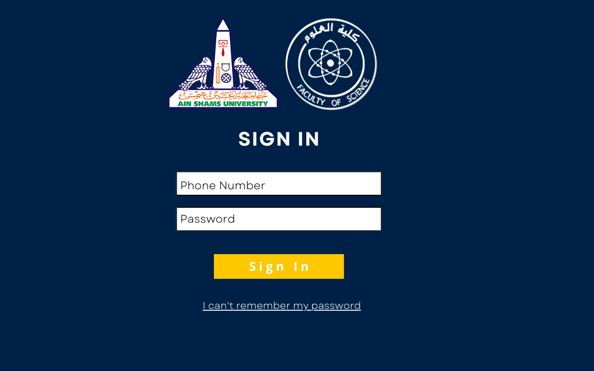
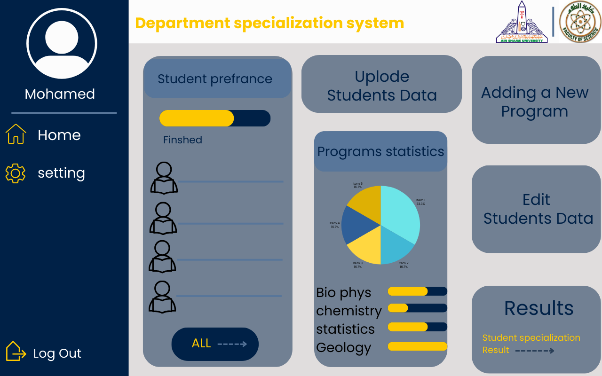

## UI Screens

### Introduction

This section showcases the login and dashboard screens of our application, illustrating the main user interactions.

### Login Screen

<figure><figcaption></figcaption></figure>

### Dashboard Screen

<figure><figcaption></figcaption></figure>

### Description

- **Login Screen:** Allows users to securely access the application.
- **Dashboard Screen:** provides a centralized view where administrators can upload student data, review preferences, and access program statistics. It offers insights into student distribution and program capacity, facilitating informed decision-making.

